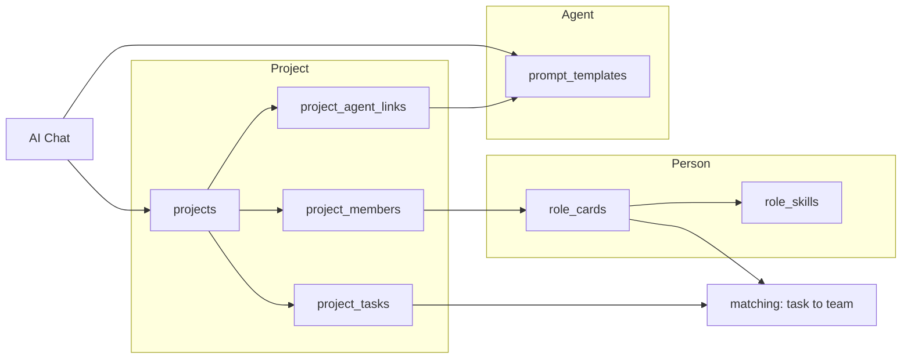

Prompt 辅助系统

1. 总体概述

1.1 项目背景

企业在进行项目规划与任务分解时，常面临资源分配依赖主观经验、跨角色协作标准不统一、专家经验难以结构化沉淀等问题。为解决上述问题，需建设一套基于自然语言处理的 AI 协作平台，通过结构化管理项目上下文、人员技能画像及领域提示词模板，辅助生成项目行动纲领及人员匹配建议。

1.2 建设目标

本平台旨在实现以下目标：
•   实现项目背景（Project）的结构化录入与全生命周期管理。

•   建立企业人员技能画像（Person），支持能力标签化管理。

•   提供领域专家级提示词模板（Agent），用于规范 AI 输出。

•   基于标签匹配算法，自动生成任务与人员的匹配度分析报告。

•   提供基于上下文的 AI 对话交互能力，辅助项目决策。

2. 核心术语定义

为避免歧义，对本文档中三个核心实体定义如下：

术语 定义

Project 表示一个具体的企业项目或业务需求，包含背景描述、目标约束及待办任务列表。

Person 表示企业中真实的员工个体。包含姓名、岗位、技能标签、当前负荷等客观数据。

Agent 表示经过特定提示词（Prompt）微调的 AI 智能体。其本质是领域知识库与思维模式的集合，不与具体自然人绑定。

3. 用户角色与职责

角色 职责描述

系统管理员 负责 Person 数据的维护、Agent 模板的审核与发布、系统权限配置。

项目经理 负责 Project 的创建、任务拆解、查看人员匹配报告、调整任务分配。

普通员工 查看与自己相关的 Project 任务，使用 Agent 进行对话咨询。

4. 功能性需求

4.1 Project（项目）管理模块

4.1.1 项目创建与编辑

•   功能描述：用户需能够创建新的项目，并填写项目元数据。

•   输入字段：

    ◦   项目名称（必填）

    ◦   项目背景描述（必填，长文本）

    ◦   关键约束条件（选填，标签形式）

    ◦   预期交付物（选填）

•   业务逻辑：系统应支持项目的增、删、改、查操作。

4.1.2 任务拆解

•   功能描述：在 Project 下创建子任务（Task）。

•   输入字段：

    ◦   任务名称

    ◦   任务描述

    ◦   所需技能标签（多选，如：前端开发、数据库设计）

    ◦   预估工时

•   输出：形成结构化的任务清单。

4.2 Person（人员）管理模块

4.2.1 人员档案维护

•   功能描述：维护企业员工的能力画像。

•   输入字段：

    ◦   姓名（唯一标识）

    ◦   所属部门

    ◦   技能标签（多选，支持自定义标签，如：React, Vue, MySQL, Python）

    ◦   当前参与项目数（系统自动计算或手动录入）

•   数据来源：支持管理员手动录入或通过 API 从 HR 系统同步。

4.3 Agent（智能体）管理模块

4.3.1 提示词模板管理

•   功能描述：管理员可配置不同的 AI 角色模板。

•   配置项：

    ◦   智能体名称（如：资深数据库架构师）

    ◦   系统提示词（System Prompt）

    ◦   输出格式规范（如：仅输出行为守则，不输出代码）

    ◦   适用场景标签

4.4 智能匹配与报告生成

4.4.1 人员匹配度分析

•   触发条件：Project 中的 Task 定义了“所需技能标签”后。

•   处理逻辑：

    1.  系统提取 Task 的技能标签集合 A。
    2.  系统遍历 Person 库，提取每个 Person 的技能标签集合 B。
    3.  计算集合 A 与 B 的交集占比，结合当前负载等因素进行综合评分。
•   输出内容：

    ◦   推荐人员姓名

    ◦   技能匹配度百分比

    ◦   匹配详情（命中标签列表、缺失标签列表）

    ◦   负载状态提示

4.4.2 项目行动纲领生成

•   触发条件：Project 创建完成后，或任务拆解完成后。

•   输出内容：基于 Project 背景生成的阶段性行动大纲，不包含具体代码实现，仅包含行为准则与阶段划分建议。

4.5 对话交互模块

4.5.1 上下文对话

•   功能描述：用户可在 Project 上下文中，选择一个 Agent 进行对话。

•   交互逻辑：

    1.  用户进入指定 Project 的对话界面。
    2.  用户从下拉菜单中选择一个已配置的 Agent（如：前端专家）。
    3.  用户输入问题。
•   后端处理：系统自动将 Project 的背景信息、当前 Task 描述以及所选 Agent 的提示词组装后提交至 LLM。

•   输出：AI 生成的回复内容，显示在对话框中。

5. 非功能性需求

5.1 数据权限

•   项目数据应遵循最小权限原则，仅允许项目相关人员查看。

•   Person 的敏感信息（如绩效数据）需进行权限隔离。

5.2 审计与追溯

•   系统需记录关键操作日志，包括但不限于：Project 的创建与修改、人员匹配报告的生成、Agent 配置的变更。

5.3 性能要求

•   AI 对话响应时间：在常规网络环境下，首字响应时间应小于 3 秒。

•   人员匹配计算：对于包含 100 个 Person 的数据集，匹配计算耗时应小于 1 秒。

6. 数据模型概要设计

6.1 Project 表（逻辑结构）

字段名 类型 说明

project_id String 项目唯一标识符

name String 项目名称

context Text 项目背景描述

constraints Array 约束条件标签

created_at Timestamp 创建时间
6.2 Person 表（逻辑结构）
字段名 类型 说明

person_id String 人员唯一标识符

name String 真实姓名

skills Array 技能标签列表

department String 所属部门

current_load Integer 当前任务数量
6.3 Agent 表（逻辑结构）
字段名 类型 说明

agent_id String 智能体唯一标识符

name String 智能体名称

system_prompt Text 系统提示词

output_format Text 输出格式约束

7. 附录：业务流程示例

场景：年会抽奖项目

1.  创建 Project：录入背景（500 人年会，需防作弊）。
2.  拆解 Task：创建“前端页面开发”任务，标记所需技能为 ["React", "前端"]。
3.  系统匹配：系统扫描 Person 库，发现“张三”的技能标签包含 ["React", "Vue", "前端"]。
4.  生成报告：输出匹配度报告，显示张三匹配度为 100%。
5.  对话咨询：项目经理选择“资深前端专家”Agent，提问：“针对抽奖动画，有哪些性能优化建议？”，系统结合 Project 上下文返回建议。

8. 本工具实现映射（代码与 API）

存储与 HTTP 命名（为兼容旧版保留表名/路径）：

| 产品概念 | 数据库表 | HTTP API |
|----------|----------|----------|
| Person | `role_cards`、`role_skills` | `/api/role-cards`；语义别名：`/api/persons`（同 CRUD） |
| Agent | `prompt_templates` | `/api/templates`（聊天选项「Agent」对应模板） |
| Project | `projects` | `/api/projects` |
| Task | `project_tasks`（技能列表存 `required_skills_json`） | `GET/POST /api/projects/{id}/tasks`，`PUT/DELETE .../tasks/{task_id}` |
| 项目已关联 Agent | `project_agent_links` | `GET/POST /api/projects/{id}/agents`，`DELETE .../agents/{link_id}` |
| 人–任务匹配（仅项目成员） | `app/matching.py` → `evaluate_persons_for_task_skills` | `POST /api/projects/{id}/tasks/{task_id}/match` |
| 旧版「全文关键词」匹配 | `evaluate_roles_for_goal` | `POST /api/role-engine/evaluate` |

引擎设置：`PUT /api/role-engine/settings` 含 `load_penalty_per_unit`（默认 3），表示每 1 点 `current_load` 从技能匹配百分比中扣减的分值。Person 扩展字段：`job_title`、`team_name`、`current_load`。SQLite 启动时会尝试 `ALTER TABLE` 补列；PostgreSQL 等需自行迁移。

9. 架构示意（概念串接）

对话只使用 **Agent + Project**；**Person 仅用于任务匹配与报告**，不参与聊天角色。
